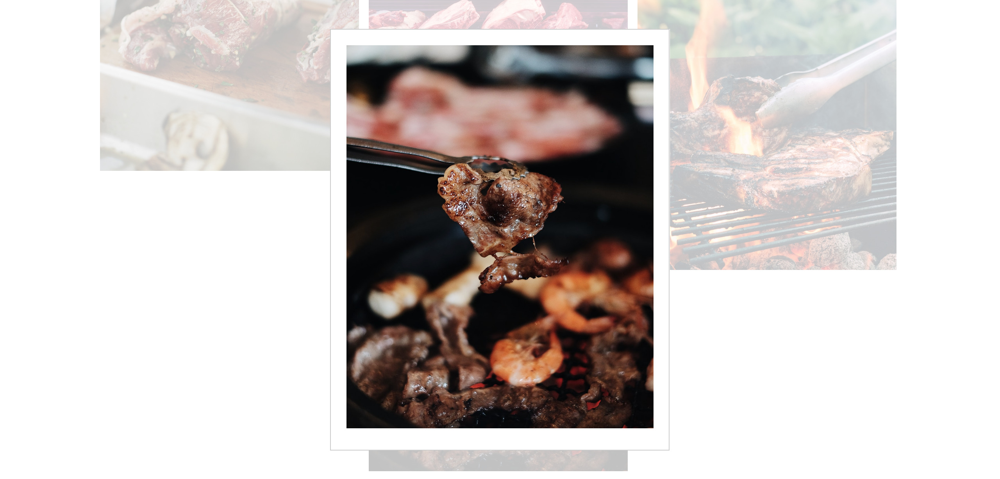
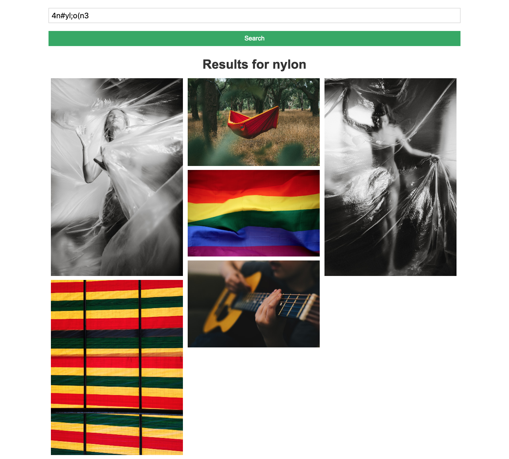
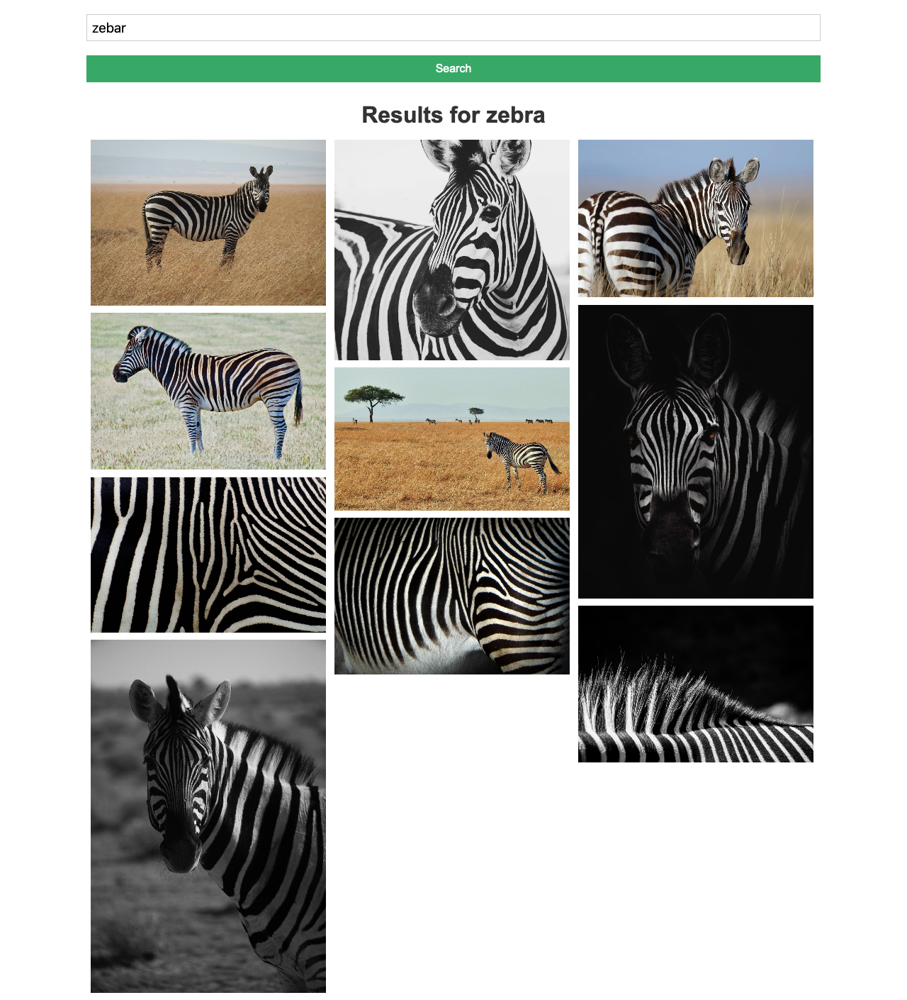
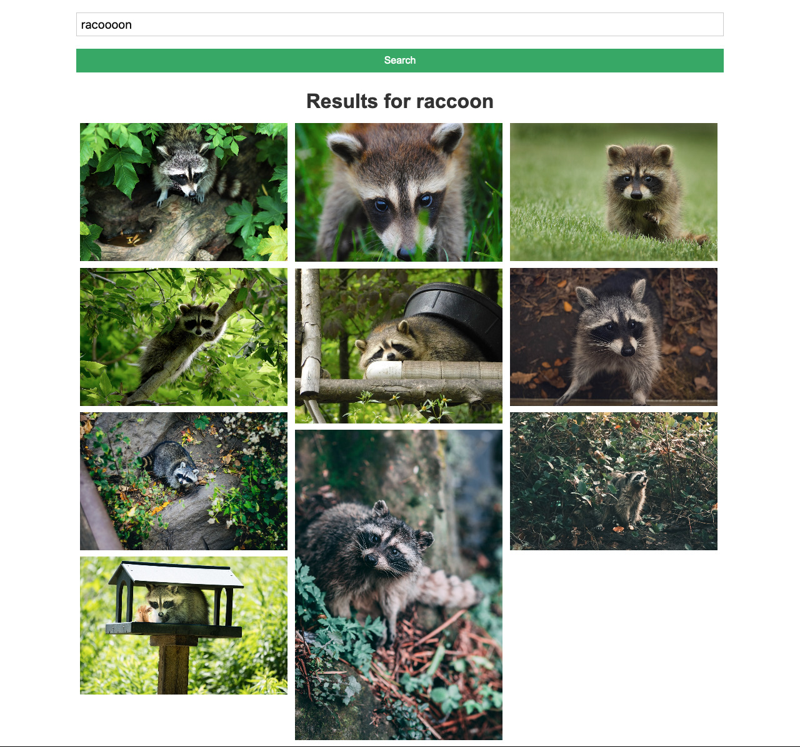
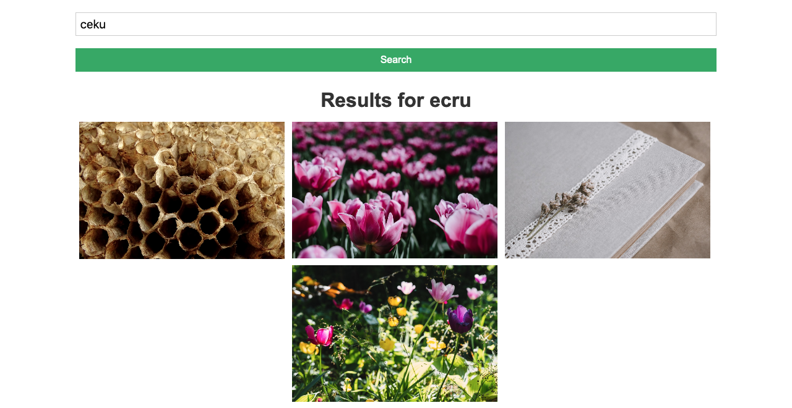
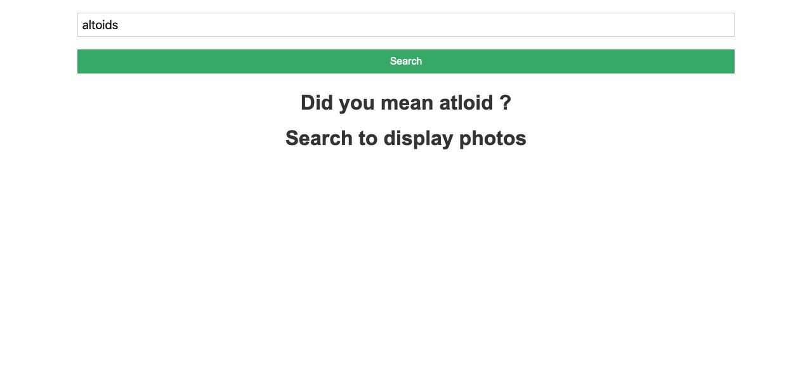

# Nisx Image Finder

[Live Demo](https://nixsimagefinder.netlify.com/)

Correct Search:

Image Modal:

Symbols and Numbers in Search

Words Swapped Search:

Incorrect spelling Search:

Best Match Search:

Best Match Search with No Results:

---

### Asumptions:

As the task prohibits any libraries or SDK that encapsulates interaction with chosen api (unsplash). I usually use Axios http library when making HTTP requests in my React applications but I was not sure if this would disqualify my project, so I decided to use the fetch api instead just to be safe.

When designing the website I assumed that I would need to write my own css so I kept it as simple and clear as possible while also making the css mobile responsive.

Before going into the spell checker I assumed that filtering all non letters and numbers and checking if the word exists in the dictionary before generating words one or two steps away. While implementing the spell checker I assumed that short circuiting after finding a correct word as soon as possible would be best for user experience as the user would not have to wait for the possible combinations to generate fully before returning any possible correct search result. The search functionality will only take into account the first found word and not the most frequent word as it is limited to how the algorithm is written with the given dictionary of words. I thought this would be acceptable as I would need a list of the most common words which seems out of scope for the spell checker.

> Correcting a Word Steps Alogirthm:
>
> Note: if at any point when generating words are found in dictionary it will return the first found word
> (steps 4 - 9)
>
> 1.  makes all letters in word lowercase and removes all symbols and numbers
> 2.  returns word if found in word dictionary after filtering invalid search characters
> 3.  if word is not in dictionary split the word into an array of characters
> 4.  generate words with letters swapped
> 5.  generate words with a letter replaced
> 6.  generate words that adds a letter to the word
> 7.  generate words that remove a letter from the word
> 8.  if word still is not found put all words that are one distance away into one array
> 9.  generate all words two distance away from all the words one distance away
> 10. if word still not found return the given word that has symbols and numbers removed

Possible errors would be the image search api(unsplash) which has no results from the search which in turn I would display the search word as it would show that it was searched. If the api is down then a loader will show after pressing search. I assumed this would be fine as the searches are up to what is available from the api itself.

The assumptions made decided how the application would be designed, executed, and the interactions within the application. From how the spell checker would return the first available search to improve on user experience to which way I would make http requests.

### Design Decisions:

When designing the website I thought a simple way was to have the requirements first and add new features after getting the base idea down. I needed to have an entry field, a button to cause the requests to search, a gallery to show off the results, and a way to display a clicked photo. From that I started drawing a simple user interface and actions that would change the websites functionality.

From drawing I went to separation of components to help me to easily separate and create components while adding on top of what I already have built. This app is a single page application so I decided to have a page folder which would just have this one page that imports all the components into itself. This would allow for new pages to be added as well as a navbar if the app were to be extended. Inside the home page there are different interactions and actions that each component would need from one another and what it can do on its own. So each component has its own separation and domain it can control which lead to separate file structures within the components folder.

As I wanted a working prototype without any spell checking functionality to get the layout and the base functionality working. I saw that there was a lot of state and props being moved around from each component which I decided to add app level state through the context api to help with readability of components and state management. The global app state would have its own folder as it has its own set up and it brings down its current state over to the components that need the state or functions from within the app level state.

After getting the base functionality working, I moved onto the search spell checking functionality. I felt that validating a word is not exactly the purpose of a search component as you can put any word into the search component and it just needs to fire an action when the button is pressed. So I decided to separate the word correction functionality into its own utils folder and import that function into the search component. The same also follows with any files like the spinner gif for the loading state component, or the dictionary of words file, I have an assets folder for any required files that the app would use.

The application was completed through iterations, assumptions and readability in mind. Through global application state to simply the application to seperation of different files and folders.

---

## How to run locally

### Prerequisites:

-node.js

-unsplash api key and secret

### Instructions:

- [Clone repository](https://github.com/niszeto/appstem_web_prototype)

- Create a ".env.local" file in the root of the application
- Create Unsplash account with API client id and client secret
- Add below to your .env.local file
  > REACT_APP_UNSPLASH_CLIENT_ID="YOUR UNSPLASH CLIENT ID"
  > REACT_APP_UNSPLASH_CLIENT_SECRET="YOUR UNSPLASH CLIENT SECRET"
- Type npm install to install dependencies of project
- Type npm start and open [http://localhost:3000](http://localhost:3000) to view it in the browser.
